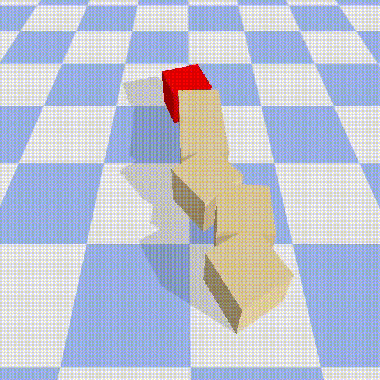

# snakebot-gym
Implements a [OpenAI gym](https://gym.openai.com/) robot snake simulation environment using [PyBullet](https://pybullet.org/wordpress/), where the goal is to move a snake robot towards a certain location. You can train Reinforcement Learning agents or define a manual movement function.

## Installation

This program was written using Python 3.8.8. Install all depencencies using:

```
pip install -r requirements.txt
```

Next, install PyTorch (v1.8.1) using the instructions [here](https://pytorch.org/get-started/locally/).

## Usage

The program can be run using the `snake.py` script. From here, you can use premade manual movement function using:

```
python snake.py manual
```

or train a Proximal Policy Optimization (PPO) agent using:

```
python snake.py train
```

To test trained models, use:

```
python snake.py test --model <path_to_model>
```

If the `--model` flag is left empty, a random agent is used. For more flag customization, use the `-h` flag.
Several trained modes are located in the `models` folder. Make sure the snake is of appropriate length (using the `snake_length` argument).

For a list of all options (training settings etc.), please use:

```
python snake.py --h
```

## Spaces
### State Space

The snake robot is build from a number of Revolute Joints. For a single joint, the state space is defined as: 

```
[angle, speed]
```

The state of the full environment is defined as the combination of all `N` joint states, plus the x, y coordinates of the snake head:

```
[headX, headY, angle1, ... angleN, speed1, ..., speedN]
```

The reward returned to the agent is defined as the negated distance towards the goal. When the goal is reached (head is within 1 meter of the goal), a reward of 100 is returned. 


### Action Space

The agent can control the position of each of the robot's `N` joints. The action space is thus defined as follows:
```
[pos1, ..., posN]
```

## Useful links

* [Pybullet docs](https://docs.google.com/document/d/10sXEhzFRSnvFcl3XxNGhnD4N2SedqwdAvK3dsihxVUA/edit#heading=h.2ye70wns7io3)
* [Pybullet examples](https://github.com/bulletphysics/bullet3/tree/master/examples/pybullet/examples)
* [OpenAI env tutorial](https://towardsdatascience.com/beginners-guide-to-custom-environments-in-openai-s-gym-989371673952)
* [RL snake paper](https://arxiv.org/pdf/1904.07788.pdf)